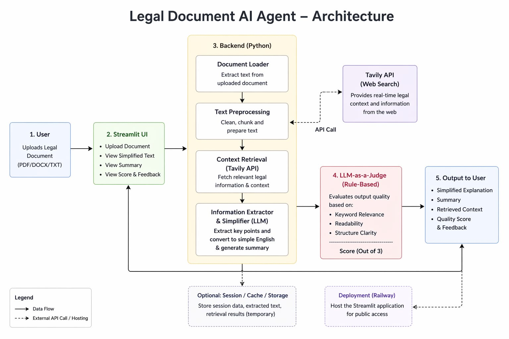

# Legal Document AI Agent

An AI-powered system that simplifies complex legal documents into easy-to-understand language using an agentic AI approach.

------------------------------------------------------------

## Problem Statement

Legal documents such as agreements, contracts, and terms and conditions are often written in complex language that is difficult for common users to understand. This project solves this problem by providing simplified explanations and summaries.

------------------------------------------------------------

## Features

- Converts legal text into simple English
- Generates summaries of documents
- Provides additional context using search (Tavily API)
- Uses LLM to evaluate output quality
- Interactive UI using Streamlit

------------------------------------------------------------

## Tech Stack

- Python
- Streamlit
- Tavily API
- Rule-Based LLM-as-a-Judge
- Railway (Deployment)

------------------------------------------------------------

## Live Demo
https://legal-ai-agent-production.up.railway.app

------------------------------------------------------------

## Architecture Diagram

------------------------------------------------------------

## ## LLM-as-a-Judge
The system evaluates output quality using a rule-based scoring mechanism based on:
- Keyword relevance
- Readability
- Structure clarity

Score is given out of 3.

-------------------------------------------------------------

## How It Works

1. User uploads legal document
2. Text is sent to Tavily API for contextual retrieval
3. System extracts relevant legal information
4. Output is simplified into readable format
5. Rule-based LLM Judge evaluates quality
6. Final result is displayed to user  

------------------------------------------------------------

## Project Files

- app.py  
- requirements.txt  
- ProblemStatement.txt  
- task_decomposition.txt  
- report.txt  

------------------------------------------------------------

## How to Run

pip install -r requirements.txt  
python -m streamlit run app.py  

------------------------------------------------------------

## Demo Video

Will be added soon

------------------------------------------------------------

## Future Scope
- Integration with real LLMs (Gemini / OpenAI)
- Better legal summarization accuracy
- Multi-language support
- Chat-based legal assistant

------------------------------------------------------------

## Authors

- Archi Dubey 
- Palak Jane  

------------------------------------------------------------

## Status

Project Completed
